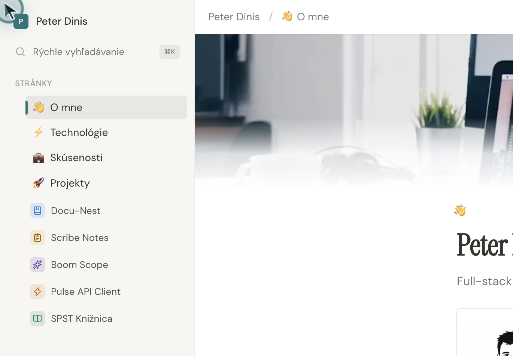
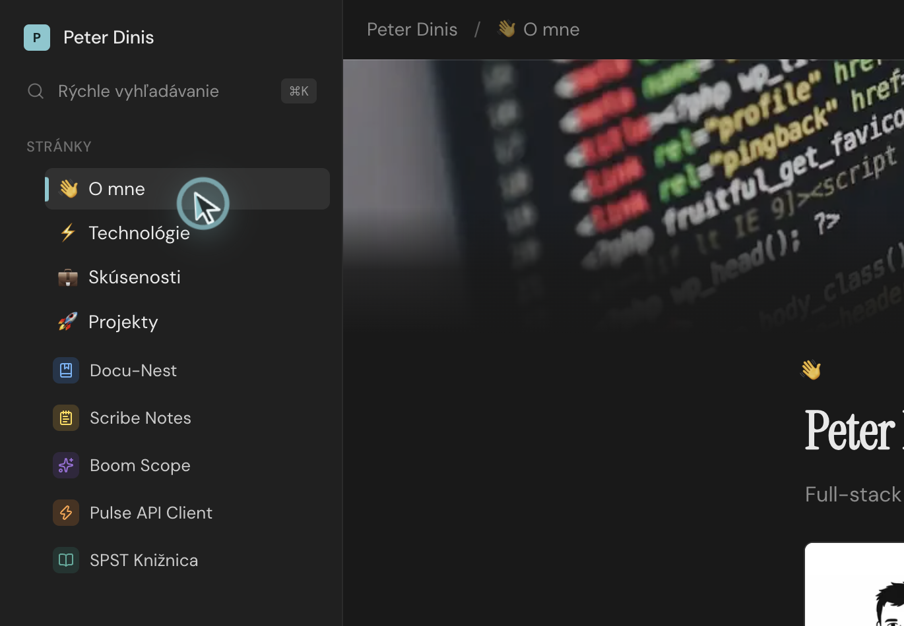
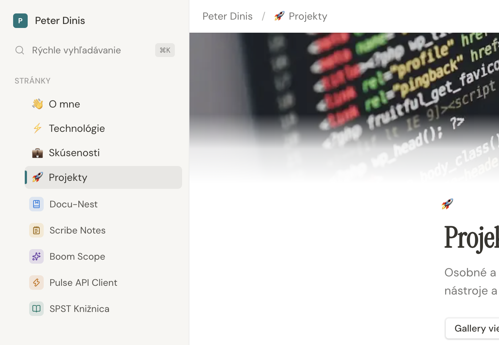
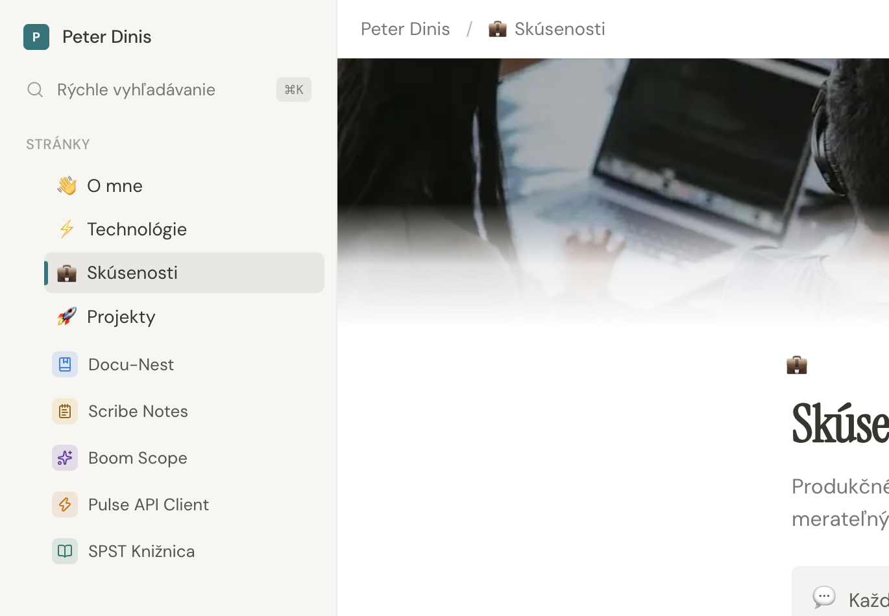
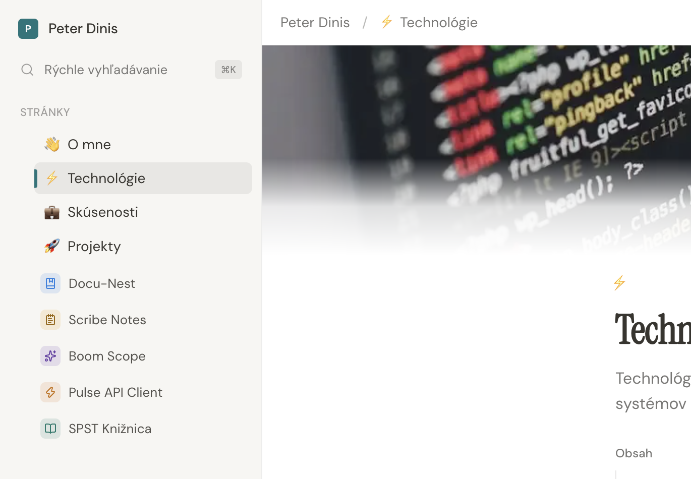
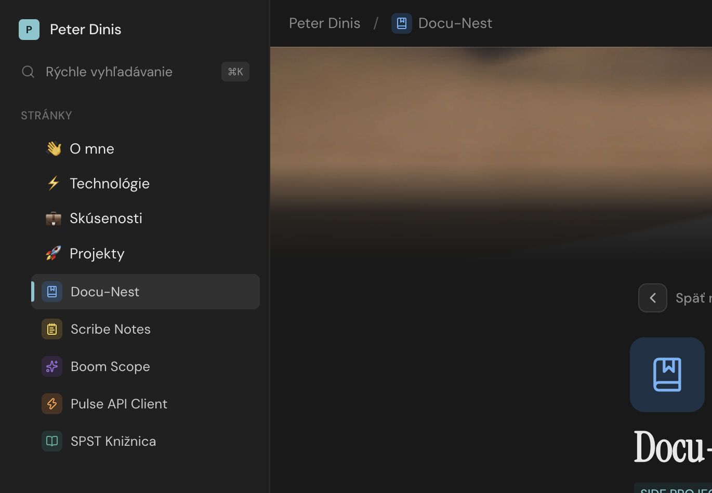

# Peter Dinis — Notion Portfolio

Interactive portfolio with a Notion-like layout: sidebar, document pages, path URLs, SK/EN language toggle, and light/dark theme. Content is authored in React.

## Preview

| About (light) | About (dark) |
|:---:|:---:|
|  |  |

| Projects | Experience |
|:---:|:---:|
|  |  |

| Technologies | Project detail |
|:---:|:---:|
|  |  |

## Stack

| Layer | Tools |
|-------|--------|
| UI | React 19, TypeScript, Vite 8 |
| Styling | Tailwind CSS v4, shadcn/ui (Radix primitives) |
| Fonts | Instrument Serif (display), DM Sans (body) |
| Motion | Framer Motion |
| State | XState (`@xstate/react`) |
| Icons | [simple-icons](https://simpleicons.org/) + Lucide |
| Quality | Biome (lint + format) |

## Getting started

**Requirements:** Node.js 20+

```bash
npm install
npm run dev
```

Open the URL shown in the terminal (usually `http://localhost:5173`).

### Production build

```bash
npm run build
npm run preview
```

## How to use

| Input | Action |
|-------|--------|
| Sidebar links | Navigate between pages (`/`, `/tech`, `/projects`, …) |
| Search | Filter pages in the sidebar |
| Header controls | Switch SK / EN and light / dark theme |
| Mobile menu | Open sidebar sheet |

Language and theme preferences are stored in `localStorage` (`portfolio-lang`, `portfolio-theme`).

## Pages

| Page | Content |
|------|---------|
| About (`/`) | Bio, interests, services |
| Technologies (`/tech`) | Stack (frontend, backend, cloud, mobile) |
| Experience (`/experience`) | Job history with collapsible roles |
| Projects (`/projects`) | Selected work with descriptions |
| Contact (`/contact`) | Email, phone, location, social links |

## Project structure

```
src/
├── components/notion/   # Shell, pages, blocks
├── components/ui/         # shadcn/ui primitives
├── context/               # XState providers
├── data/                  # portfolio.ts, technologies.ts
├── i18n/translations.ts   # SK / EN copy
├── lib/                   # utils, SEO, routing
├── machines/              # settingsMachine
└── index.css              # Tailwind + theme tokens
```

## Customize content

| What | Where |
|------|--------|
| Profile, projects, socials | `src/data/portfolio.ts` |
| Tech stack | `src/data/technologies.ts` |
| All UI copy (SK / EN) | `src/i18n/translations.ts` |
| Page components | `src/components/notion/pages/` |
| Sidebar / nav | `src/components/notion/nav.ts` |

## Scripts

| Command | Description |
|---------|-------------|
| `npm run dev` | Start Vite dev server |
| `npm run build` | Typecheck + production build |
| `npm run preview` | Preview production build |
| `npm run verify` | `tsc` + Biome CI |

## SEO

Meta tags, Open Graph, Twitter cards, canonical URLs, breadcrumbs JSON-LD and `Person` / `ProfilePage` schema update when **language** or **page** (`/`, `/tech`, …) changes.

| File | Purpose |
|------|---------|
| `index.html` | Default SK meta (crawlers without JS) |
| `src/lib/seo.ts` | Dynamic SEO per page + language |
| `src/components/SeoManager.tsx` | Syncs SEO on navigation |
| `public/robots.txt` | Crawler rules |
| `public/sitemap.xml` | All portfolio sections |
| `public/og-image.jpg` | Social preview image |

### Deploy setup

```bash
cp .env.example .env
# Set your production domain:
# VITE_SITE_URL=https://your-domain.com
```

Regenerate `robots.txt` and `sitemap.xml` from `.env`:

```bash
npm run seo:generate
```

`npm run build` runs this automatically before the Vite build.

## License

Private project — Peter Dinis © 2026
